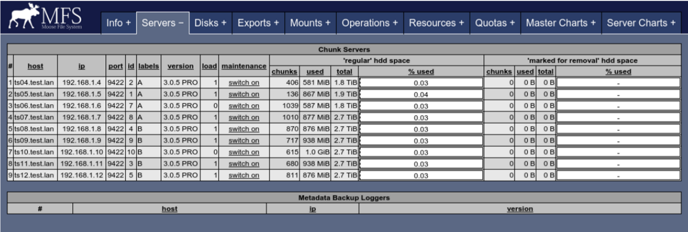
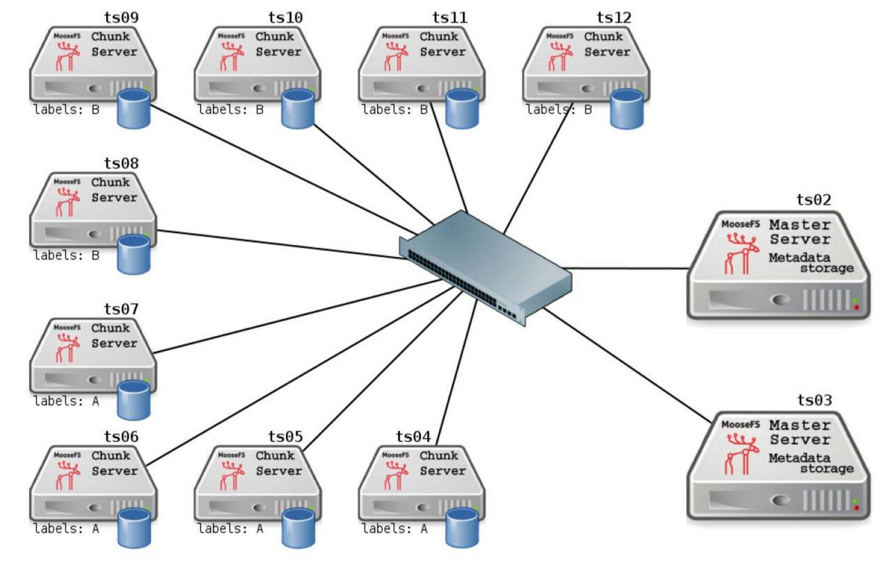

## chunkserver使用标签功能 

启用系统标签功能，例如 ` chunkserver ` ，你需要编辑 ` chunkserver ` 的配置文件 ( ` /etc/mfs/mfschunkserver.cfg ` )。打开文件反注释以下行，并在等号右边添加字符，该字符即为此 chunkserver 指定的标签。
 
例如，为一组 chunkserver (ts04,ts05,ts06,ts0) 设置标签 ` A ` ，则他们的配置文件应该为： 

```bash
# … 
# 标签字符 (默认为空, 即 无标签) 
LABELS = A 
# … 
```

随后重新载入 chunkserver 的配置文件。命令为： 

```bash
root@chunkserver:~#  service moosefs-pro-chunkserver reload 
```

 
类似的，为另一组 chunkserver(ts08,ts09,ts10,ts11,ts12)设置标签 B。 
在完成上面操作后，你可以在 CGI 监视器上看到，chunkserver ts04..07 有标签 A，而 chunserver ts08..ts12 含有标签 B 



下图显示了当前系统配置： 




