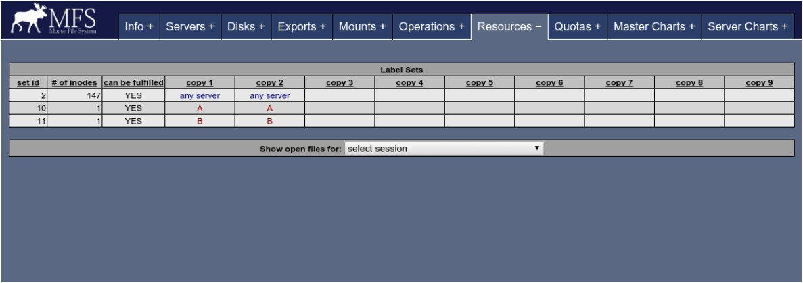
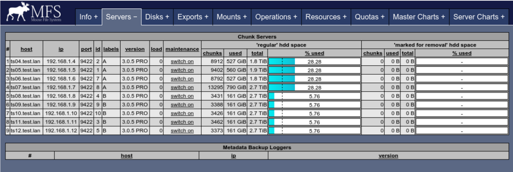

## 设置“标签goal类型” 

现在是时候向 MooseFS 实例中存放一些文件了。在此之前，你需要指定哪些数据将使用标签 A，哪些使用标签 B。 
 
在本例中将创建两个目录，分别命名为labelA和labelB 首先， 挂载MooseFS文件系统： 

```bash
root@client:~ # mkdir –p /mnt/mfs root@client:~ # mfsmount /mnt/mfs 
 root@client:~ # cd /mnt/mfs 
```

 
其次，创建两个目录： 

```bash
root@client:/mnt/mfs # mkdir -p labelA  root@client:/mnt/mfs # mkdir -p labelB 

```

再次，为目录/mnt/mfs/labelA设置2A(double A)标签 

```bash

root@client:/mnt/mfs # mfssetgoal 2A labelA labelA: 
  inodes with goal changed:    1   inodes with goal not changed:   0   inodes with goal not changed:   0 
```

这意味着，该目录及其子母和文件等在存储时将会有两份副本：其中一份副本将被存放在其中一台标签 A 的 chunkserver 上，另一份在另一台标签 A 的 chunkserver 上。 
 类似的，为目录/mnt/mfs/labelB设置2B(double B)标签: 

```bash
root@client:/mnt/mfs # mfssetgoal 2B labelB labelB: 
  inodes with goal changed:    1   inodes with goal not changed:   0   inodes with goal not changed:   0 
```

参考第三章：新 mfssetgoal 选项，了解更多关于为文件设置标签的信息 现在，在 MooseFS 监视器(资源分页 )上，你可以看到 goal 类型被设置并应用。 




### 创建文件 

该步骤中，你需要在之前创建的目录(labelA 和 labelB)中创建一些文件，用于存储在 MooseFS 实例中。该操作可能会耗费一段时间。执行随后命令： 

```bash

root@client:/mnt/mfs # cd labelA 
root@client:/mnt/mfs/labelA # for i in 'seq 1 120'; do dd if=/dev/zero of=dd10G_$i.bin bs=1M count=10240; done  
root@client:/mnt/mfs/labelA # cd ../labelB 
root@client:/mnt/mfs/labelB # for i in 'seq 1 40 '; do dd if=/dev/zero of=dd10G_$i.bin bs=1M count=10240; done 

```

> 注意：该命令将会创建大约 3.2TiB（1.6TiB 乘以 goal 2）的数据——目录 labelA 大约有 2.4TiB，目录 labelB 大约有 800GiB。可以根据自己的实际情况调整命令。 
 
### 使用标签后的文件系统的平衡状态 

现在你可以观察到，文件系统按照标签策略达到了平衡状态： goal 类型为 2A 的文件存放在含有 A 标签的 chunkserver 中。；类似的，设置了 goal 2B 的文件存放在含有 B 标签的 chunkserver 中： 
 

 
注意：系统看起来并不“平衡”，但事实上是平衡了的，按照 goals 类型的标签属性实现了存储平衡。 
 
同样的，在“资源”分页中，inodes 的数目发生了变化： 
  


