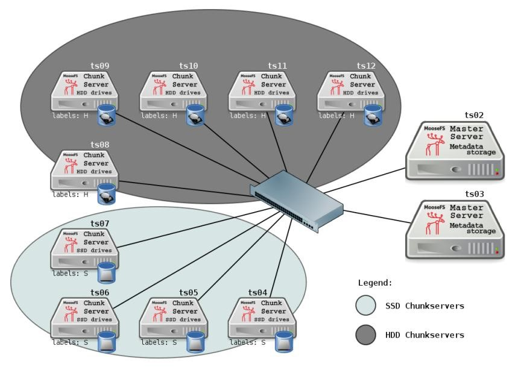

## 案例 2：SSD 与 HDD 磁盘 

假设chunkserver ts04..ts07都使用SSD磁盘，chunkserver ts08..ts12使用HDD磁盘。例如，为HDD 磁盘的chunkserver指定标签H，SDD磁盘的chunkserver指定标签S。 




可以通过配置标签，将常用的数据存放在SSD chunkserver上，不常用的放在HDD chunkserver 上。 
也可以轻易的将一些数据（例如，几年前的冷数据）从SSD上转移到HDD chunkserver上；要实现这个操作，只需要将goal类型从S改成H，MooseFS会自动执行转移工作。 
 
例如：MooseFS挂载了有一个名为Reports2014的目录。该目录及其子目录和文件经常被其他程序使用。你想要： 
+ 该目录需要保留四份副本——这些文件特别重要 
+ 提高目录的访问速度 因此，需要设置goal类型为4S（四份副本、使用SSD磁盘）。命令如下：

```bash 
root@client:/mnt/mfs# mfssetgoal -r 4S Reports2014 
```

但2014年过去了，Reports2014目录现在不会被经常使用，需要释放这部分SSD磁盘以便存放新数据。因此你想将该目录及其子目录和文件移动到HDD磁盘上并只保留三份副本。同样你也只需要修改goal类型命令如下： 

```bash
root@client:/mnt/mfs # mfssetgoal -r 3H Reports2014 
```

MooseFS谨慎执行移动操作保证数据安全，且数据在从SSD移动到HDD的过程中是可以被访问的。 	 
