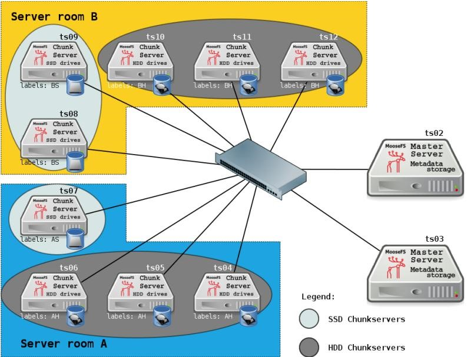

## 案例 3：双机房（A 和 B）与 SSD/HDD 磁盘的组合 
注意：在该案例中，A、B机房之间的连接速度要求非常快。 



如上图所示，该案例是案例1和2的搭配使用。我们假定，在两个机房中有分别有两种类型的 chunkserver：HDD chunkserver与SSD chunkserver 
 
现在你想将常用的数据放在SSD chunkserver上，偶尔使用的数据放在HDD chunkserver上。并且在两个机房中都需要存放数据副本。 首先，根据案例中的上述需求，你需要设置如下标签： 
+ 机房A，SSD chunkserver：标签A和S 
+ 机房A，HHD chunkserver：标签A和H 
+ 机房B，SSD chunkserver：标签B和S 
+ 机房B，HHD chunkserver：标签B和H 
 
其次，你需要为文件设置合适的goal类型： 
经常使用的目录被称为Frequent：需要在SSD磁盘上存放2份副本，一份放在机房A，一份放在机房B 

```bash
root@client:/mnt/mfs# mfssetgoal -r AS,BS Frequent 
```

偶尔使用的目录被称为Rare：需要在HDD磁盘上存放2份副本，一份放在机房A，一份放在机房B 

```bash
root@client:/mnt/mfs# mfssetgoal -r AH,BH Rare
```

如此这般，目录Frequent（及其子目录和文件）现在被保存在同时含有标签A和S及B和S的 chunkserver上。 

目录Rare（及其子目录和文件）现在被保存在同时含有标签A和H及B和H的chunkserver上。 
 
另外，需要将为名Backup的目录保留三份副本。将一份放在机房A的SSD chunkserver上，另外两份副本放在机房B的SSD和HDD chunkserver上。命令如下： 

```bash
root@client:/mnt/mfs# mfssetgoal -r AS,2B[H+S] Backup 
```

这里使用了标签的交集和并集用法。获取更多信息，参考本文的第三章：新mfssetgoal选项。 
 
获取更多关于mfssetgoal用法的例子，参考本文第三章：新mfssetgoal选项的第3.2节：举个栗子。 
 
